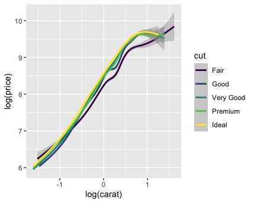
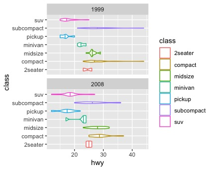
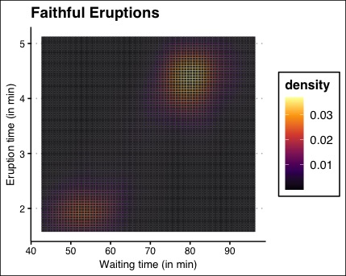

# Visualisation Assessment

# Task

Using the `ggplot2` and optionally `ggthemes` libaries redraw the following plots. 

Please submit your plots and your R script via email to me.

## Plot 1

Using the `diamonds` data:

## Plot 2

Using the `mpg` data (hint: have a look at the `draw_quantiles` parameter of `geom_violin`):

## Plot 3

Using the `faithfuld` data (hint: add `scale_color_viridis_c()` and also modify the `labs()`; the theme used here is `theme_clean()`, but you can use the basis ggplot theme too):

